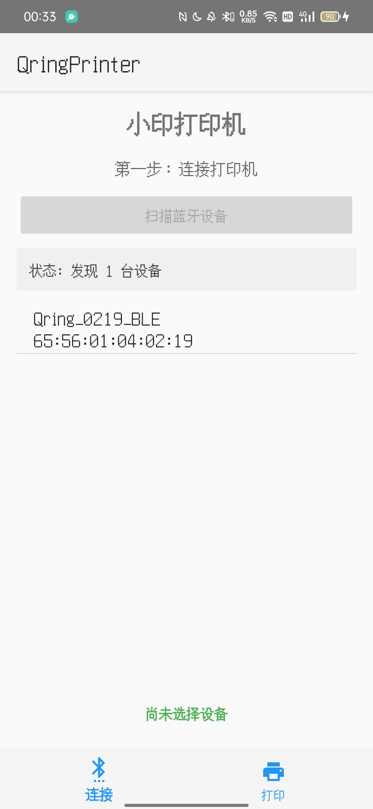
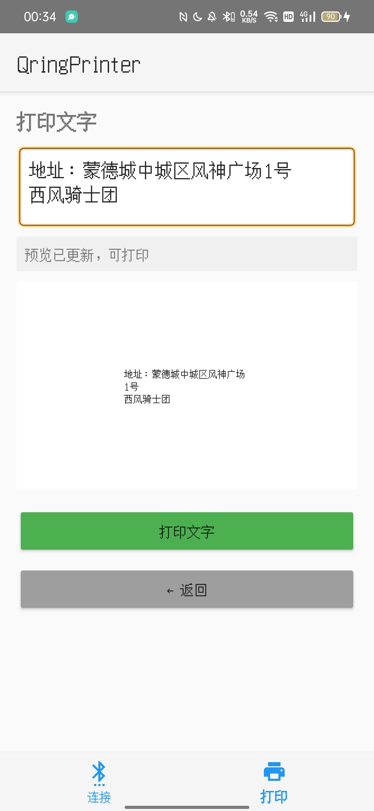
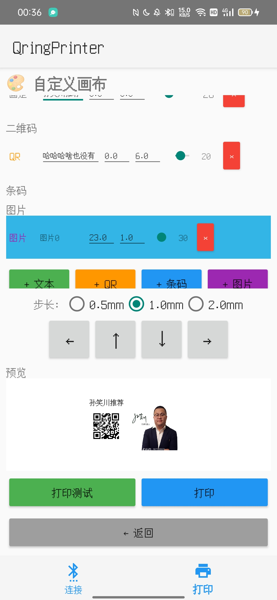

# QringPrinter – 错题小印热敏打印机助手

**QringPrinter** 是一款专门为 **小印（Qring / BeePrt BY）系列热敏打印机** 设计的 Android 客户端。它完全离线，无需任何云端服务，通过蓝牙 SPP 协议直接与打印机通信，支持文字、图片、PDF、表格以及自定义标签画布打印。

> 本项目基于 MIT 许可证开源，欢迎学习、使用和二次开发。

---

## 功能特性

-  **蓝牙设备管理** – 自动扫描并过滤名称包含 `Qring` 的打印机，一键连接。
-  **图片打印** – 从相册选择图片，自动缩放至 384 点宽，支持 Floyd‑Steinberg 抖动。
-  **文字打印** – 输入文字，实时预览黑白效果，支持自动换行。
-  **PDF 打印** – 选择 PDF 文件，支持页码选择，逐页渲染打印。
-  **自定义打印（表格）** – 导入 CSV 数据，自由绑定列位置、字号，批量打印。
-  **自定义打印（画布）** – 自由添加文本、二维码、条码、图片，独立调整位置和大小。
-  **标签设置** – 支持调整页面高度、走纸间隔、自动裁剪底部空白。
-  **开屏与动画** – 平滑的过渡动画，友好的用户体验。

---

## 截图

| 主界面 | 文字打印 | 自定义画布 |
|---|---|---|
|  |  |  |

---

## 下载安装

- 最新稳定版 APK：[下载链接](https://github.com/BA4RFY/QringAndroid/releases/latest)
- 或从 Releases 页面下载历史版本。

**安装要求**：
- Android 7.0 (API 24) 及以上。
- 支持蓝牙 SPP 协议的手机。

---

## 编译与开发

### 环境要求
- Android Studio Ladybug 或更高版本
- JDK 17
- Android SDK 36

### 克隆项目

git clone https://github.com/BA4RFY/QringAndroid.git

### 导入并构建
1. 用 Android Studio 打开项目。
2. 等待 Gradle 同步完成。
3. 连接真机或启动模拟器，点击 `Run` 运行。
4. 如需生成签名 APK，使用 `Build → Generate Signed Bundle / APK`。

---

## 使用的开源库
- https://github.com/Thisko/QrintPrint - **大佬开发的鸿蒙版和python文件是整个项目的根基**
- [ZXing](https://github.com/zxing/zxing) – 二维码/条码生成
- [Material Components for Android](https://github.com/material-components/material-components-android) – 底部导航、Material 风格
- [PdfRenderer](https://developer.android.com/reference/android/graphics/pdf/PdfRenderer) – 内置 PDF 渲染（Android 5.0+）

---

## 许可证

本项目采用 **MIT License**，详情参见 [LICENSE](LICENSE) 文件。

---

## 贡献

欢迎提交 Issue 和 Pull Request。

---

**如果觉得这个项目对你有帮助，请给一个 ⭐ Star吧！**
感谢大佬栽树！
